# 5G power optimization
MATLAB implementation of the power optimization in 5G networks with Massive MIMO technique using the Dinkelbach algorithm and Water Filling, both uplink and downlink, on Sum Rate and Energy Efficiency.

 
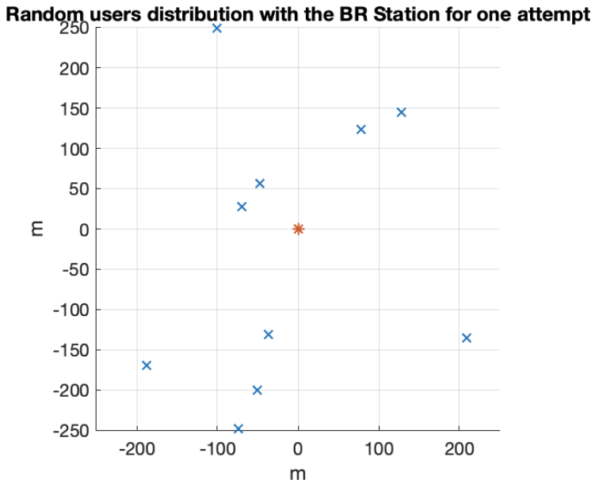  

# File organization

The repository is divided into two different folders. In order to start the simulation open each single folder in MATLAB and run the corresponding starting point:

- **uplink**: optimization in uplink comunication. The starting point is the file *main_uplink.m*. The problem is divided into:
    - **Sum Rate optimization**: Each user can transmit to its maximum power.  
    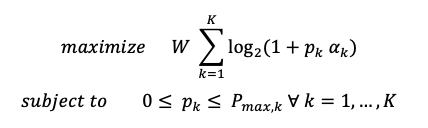  
    - **Energy Efficiency optimization**: the Dinkelback algorithm optimaze the ratio of the Energy Efficiency. 
    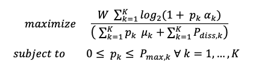  
     
    The algorithm maxime the auxilary function of the fractional problem:
     
    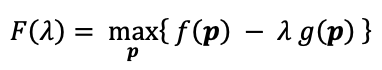  
    The algorithm:
     
    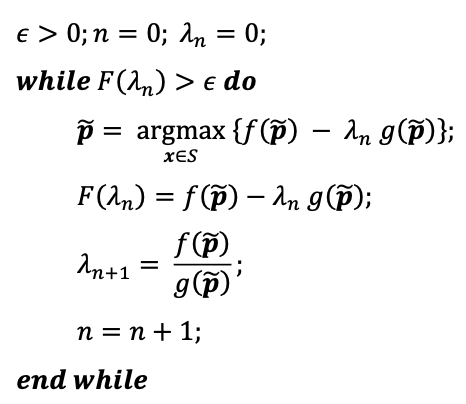  

- **downlink**: optimization in downlink comunication. The starting point is the file *main_downlink.m*. The problem is divided into:
    - **Sum Rate optimization**: The radio base station have to transmit towards every user, considering that the sum of all the power allocated to the users have to sum up the maximum power available to the station.  
    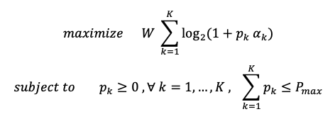  
    The power is allocated with the Water Filling algorithm:
     
    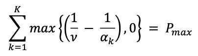  
    - **Energy Efficiency optimization**: as for the uplink problem, the Dinkelback algorithm optimaze the ratio of the Energy Efficiency. 
    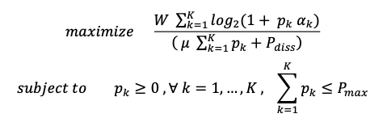  

# Simulation
Each problem compare the optimal power allocation with the uniform one, considering also the case with and without interference.

The channel parameters are extracted from a normal distribution.

**uplink**:
 
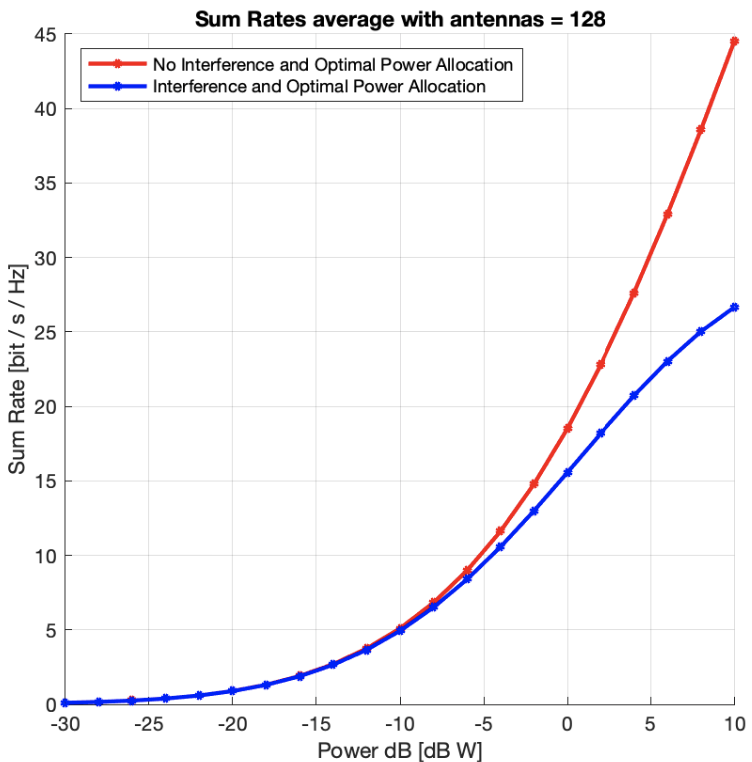  
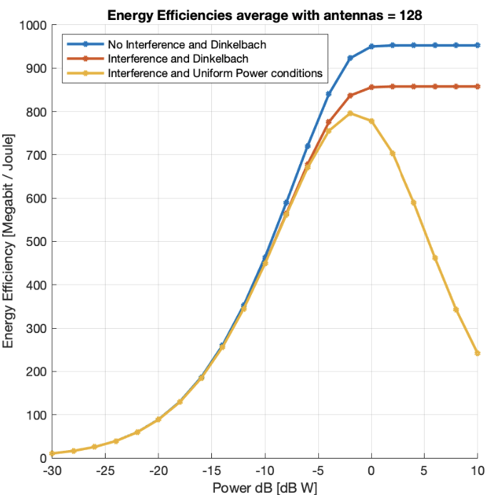  

**downlink**:
 
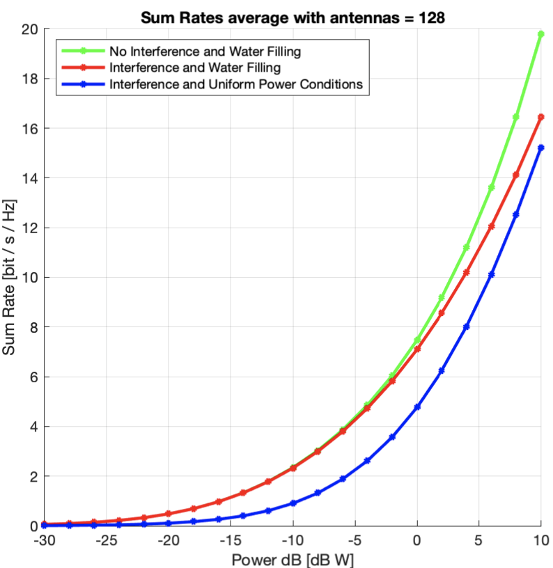  
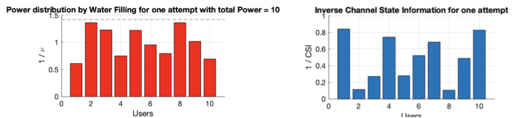  
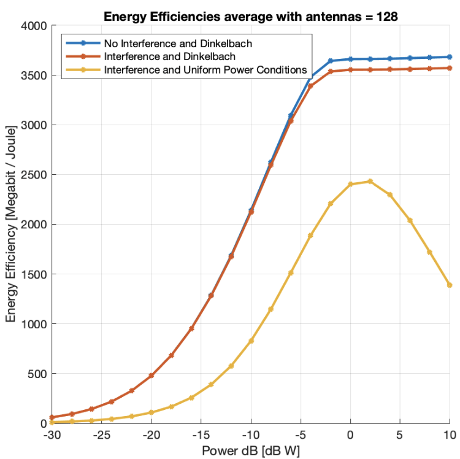  

